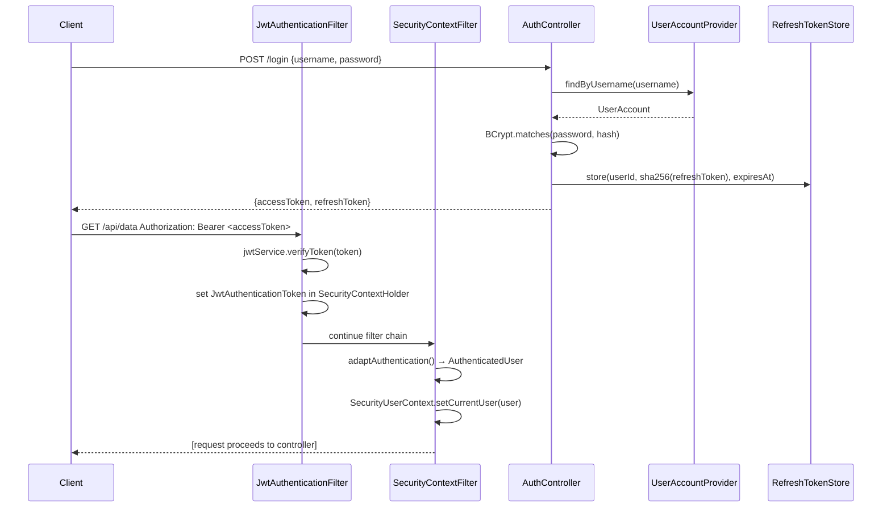

<div align="center">

# 🔐 Spring Security Explainer

**Zero-configuration JWT security for Spring Boot. One dependency. One interface. Done.**

[](https://central.sonatype.com/artifact/io.github.adepusricharan/security-starter)
[](https://github.com/AdepuSriCharan/spring-security-starter/actions/workflows/maven.yml)
[](https://www.apache.org/licenses/LICENSE-2.0)
[](https://www.oracle.com/java/)
[](https://spring.io/projects/spring-boot)
[](CONTRIBUTING.md)

</div>

---

## What Problem Does This Solve?

Securing a Spring Boot REST API with JWT is not hard — it just takes a lot of code that every team re-writes from scratch and frequently gets wrong:

- Custom `SecurityFilterChain` with all the right settings
- JWT verification filter that clears stale context on failure
- Refresh token rotation with replay-attack detection
- SHA-256 hashing of stored tokens (never store raw tokens)
- Atomic consume-and-revoke for multi-instance deployments
- Structured JSON `401` / `403` error responses (not Spring's default HTML)
- Micrometer metrics and structured audit logs

**Spring Security Explainer does all of that for you.** It is a production-ready Spring Boot auto-configuration starter that provides the full JWT security layer out of the box. Developers implement **one interface** to plug in their data source, and the library handles the rest — fully overridable via standard Spring Boot `@ConditionalOnMissingBean` conventions.

---

## Features

**Authentication**
- Three modes: `INTERNAL` (self-managed JWT), `OAUTH2` (generic OIDC), `KEYCLOAK` (Keycloak-specific)
- Built-in `/login`, `/refresh`, `/logout` endpoints (INTERNAL mode)
- Access + refresh token lifecycle with configurable TTLs
- Refresh token rotation with **replay-attack detection**
- SHA-256 hashing of stored tokens — raw tokens are never persisted
- Redis-backed refresh token store for multi-instance production deployments

**Authorization**
- `@RequireRole("ADMIN")` — role-based access control via AOP
- `@RequirePermission("post:delete")` — fine-grained permission checks via AOP
- `@RequireOwner("#userId")` — SpEL-based resource ownership enforcement
- Structured JSON `403` responses with full diagnostic context

**Observability**
- Security audit events (`LOGIN_SUCCESS`, `REFRESH_REPLAY_DETECTED`, `ACCESS_DENIED`, etc.)
- Pluggable `SecurityAuditSink` — route events to Kafka, SIEM, Splunk, or any system
- Micrometer metrics: `security.audit.events` counter, `security.auth.refresh.latency` timer
- Micrometer is **optional** — the starter works without it on the classpath

**Extensibility**
- Every auto-configured bean uses `@ConditionalOnMissingBean` — override anything by declaring your own `@Bean`
- Pluggable `UserAccountProvider` SPI — wire any data source (JPA, MongoDB, LDAP, in-memory)
- Pluggable `RefreshTokenStore` SPI — bring your own persistence backend
- Pluggable `AuthenticationAdapter` SPI — bridge any authentication source to `AuthenticatedUser`

---

## Architecture Overview

```mermaid
graph TD
    A[HTTP Request] --> B{Auth Mode?}
    B -->|INTERNAL| C[JwtAuthenticationFilter]
    B -->|OAUTH2 / KEYCLOAK| D[BearerTokenAuthenticationFilter]
    C --> E[SecurityContextFilter]
    D --> E
    E --> F{Authenticated?}
    F -->|No| G[JsonAuthenticationEntryPoint → 401 JSON]
    F -->|Yes| H[AuthenticatedUser in ThreadLocal]
    H --> I[Controller Method]
    I --> J{Authorization Annotation?}
    J -->|@RequireRole| K[AuthorizationAspect → AuthorizationManager]
    J -->|@RequirePermission| K
    J -->|@RequireOwner| L[SpEL Evaluation]
    K --> M{Authorized?}
    L --> M
    M -->|Yes| N[Business Logic]
    M -->|No| O[SecurityExceptionHandler → 403 JSON]
    N --> P[SecurityAuditEventRecorder]
    O --> P
    P --> Q[SecurityAuditSink + Micrometer]
```

---

## Quick Start

### 1. Add the Dependency

```xml
<dependency>
    <groupId>io.github.adepusricharan</groupId>
    <artifactId>security-starter</artifactId>
    <version>1.2.1</version>
</dependency>
```

> For **OAUTH2 / KEYCLOAK** modes, also add `spring-boot-starter-oauth2-resource-server`.

### 2. Configure

```properties
# application.properties
security.auth-mode=INTERNAL
security.jwt.secret=${JWT_SECRET}          # minimum 32 characters
security.jwt.expiration-ms=3600000         # 1 hour
security.jwt.refresh-expiration-ms=604800000  # 7 days
security.jwt.issuer=my-application
security.public-endpoints=/register,/health
```

### 3. Implement `UserAccountProvider`

```java
@Service
public class MyUserAccountProvider implements UserAccountProvider {

    private final UserRepository repository;

    @Override
    public Optional<UserAccount> findByUsername(String username) {
        return repository.findByUsername(username)
                .map(user -> new UserAccount() {
                    public String getId()               { return user.getId(); }
                    public String getUsername()         { return user.getUsername(); }
                    public String getPassword()         { return user.getPasswordHash(); }
                    public Set<String> getRoles()       { return user.getRoleNames(); }
                    public Set<String> getPermissions() { return user.getPermissions(); }
                });
    }
}
```

**That's it.** Your application now has:
- `POST /login` → returns `{ accessToken, refreshToken, tokenType, expiresIn }`
- `POST /refresh` → rotates the refresh token pair
- `POST /logout` → revokes the refresh token
- JWT validation on every protected request
- `@RequireRole`, `@RequirePermission`, `@RequireOwner` on any controller method

---

## Authentication Flow



---

## Authorization Annotations

Apply these to any Spring MVC controller method:

```java
// Only users with ADMIN role may access
@GetMapping("/admin/dashboard")
@RequireRole("ADMIN")
public Dashboard getAdminDashboard() { ... }

// Multiple roles — any one is sufficient
@GetMapping("/reports")
@RequireRole({"ADMIN", "MANAGER"})
public List<Report> getReports() { ... }

// Fine-grained permission check
@DeleteMapping("/posts/{id}")
@RequirePermission("post:delete")
public void deletePost(@PathVariable Long id) { ... }

// Resource ownership — SpEL extracts the owner ID from method args
@GetMapping("/users/{userId}/profile")
@RequireOwner("#userId")
public Profile getProfile(@PathVariable String userId) { ... }
```

Access the authenticated user anywhere in the request thread:

```java
@Service
public class OrderService {
    public Order createOrder(CreateOrderRequest request) {
        AuthenticatedUser user = SecurityUserContext.requireCurrentUser();
        // user.getUserId(), user.getRoles(), user.getPermissions()
    }
}
```

---

## Configuration Reference

| Property | Default | Description |
|---|---|---|
| `security.auth-mode` | `INTERNAL` | `INTERNAL` \| `OAUTH2` \| `KEYCLOAK` |
| `security.public-endpoints` | — | Comma-separated Ant patterns (e.g. `/health,/public/**`) |
| `security.jwt.secret` | — | **Required** for INTERNAL. Min 32 chars. |
| `security.jwt.expiration-ms` | `3600000` | Access token TTL (1 hour) |
| `security.jwt.refresh-expiration-ms` | `604800000` | Refresh token TTL (7 days) |
| `security.jwt.issuer` | `spring-security-explainer` | JWT `iss` claim |
| `security.refresh.store-mode` | `INMEMORY` | `INMEMORY` \| `REDIS` |
| `security.refresh.redis.key-prefix` | `security:refresh` | Redis key namespace |
| `security.security-events.enabled` | `true` | Enable/disable audit events |
| `security.oauth2.issuer-uri` | — | Required for OAUTH2/KEYCLOAK |
| `security.oauth2.keycloak-client-id` | — | Required for KEYCLOAK client role extraction |

See [`docs/Configuration.md`](docs/Configuration.md) for the complete reference.

---

## Overriding Defaults

Every auto-configured bean uses `@ConditionalOnMissingBean`. Declare your own `@Bean` to replace any default:

```java
@Configuration
public class SecurityConfig {

    // Swap BCrypt for Argon2
    @Bean
    public PasswordEncoder passwordEncoder() {
        return new Argon2PasswordEncoder(16, 32, 1, 65536, 10);
    }

    // Route audit events to Kafka
    @Bean
    public SecurityAuditSink kafkaAuditSink(KafkaTemplate<String, SecurityAuditEvent> kafka) {
        return event -> kafka.send("security-events", event);
    }

    // Bring your own RefreshTokenStore (JPA, DynamoDB, etc.)
    @Bean
    public RefreshTokenStore jpaRefreshTokenStore(JpaRefreshTokenRepository repo) {
        return new JpaRefreshTokenStore(repo);
    }
}
```

---

## Documentation

| Topic | Document |
|---|---|
| Architecture deep-dive | [docs/Architecture.md](docs/Architecture.md) |
| Authentication flow | [docs/Authentication-Flow.md](docs/Authentication-Flow.md) |
| Authorization annotations | [docs/Authorization.md](docs/Authorization.md) |
| JWT internals | [docs/JWT.md](docs/JWT.md) |
| All configuration properties | [docs/Configuration.md](docs/Configuration.md) |
| Customization & extension points | [docs/Customization.md](docs/Customization.md) |
| Auto-configuration internals | [docs/AutoConfiguration.md](docs/AutoConfiguration.md) |
| Filter chain explained | [docs/Filters.md](docs/Filters.md) |
| Exception handling | [docs/ExceptionHandling.md](docs/ExceptionHandling.md) |
| Working examples | [docs/Examples.md](docs/Examples.md) |
| Troubleshooting | [docs/Troubleshooting.md](docs/Troubleshooting.md) |
| FAQ | [docs/FAQ.md](docs/FAQ.md) |
| Migration guide | [docs/MigrationGuide.md](docs/MigrationGuide.md) |

---

## Roadmap

See [`ROADMAP.md`](ROADMAP.md) for the full roadmap. Upcoming highlights:

- **v1.2.0** — Rate limiting, account lockout, session management API
- **v1.3.x** — RS256/ES256 signing, JWKS endpoint, API key authentication
- **v2.x** — Multi-tenancy, AI agent identity, Security Console UI

---

## Contributing

Contributions are welcome. Please read [`CONTRIBUTING.md`](CONTRIBUTING.md) before opening a pull request.

```bash
git clone https://github.com/AdepuSriCharan/spring-security-starter.git
cd spring-security-starter
./mvnw clean install -DskipTests   # build all modules
./mvnw test                        # run all tests
```

---

## License

Apache License 2.0 — see [`LICENSE`](LICENSE).

---

<div align="center">

**Built for the Spring Boot community**

[⭐ Star](https://github.com/AdepuSriCharan/spring-security-starter) · [🐛 Report a Bug](https://github.com/AdepuSriCharan/spring-security-starter/issues) · [💡 Request a Feature](https://github.com/AdepuSriCharan/spring-security-starter/issues) · [📖 Docs](docs/)

</div>
