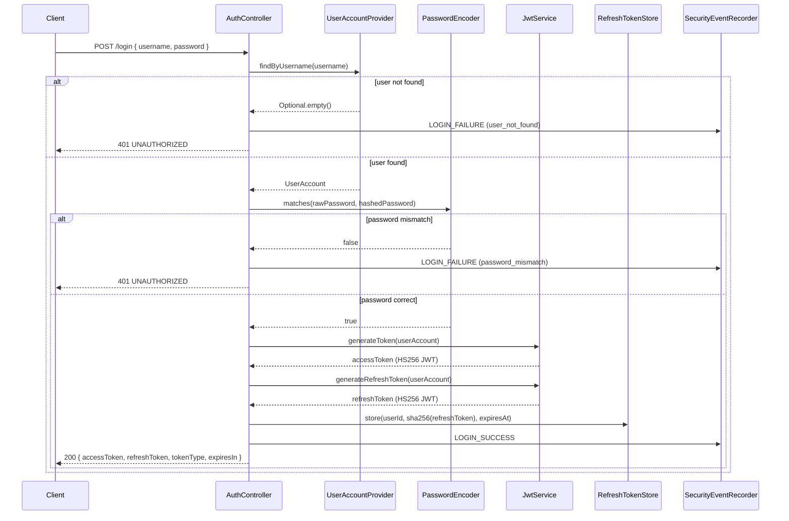
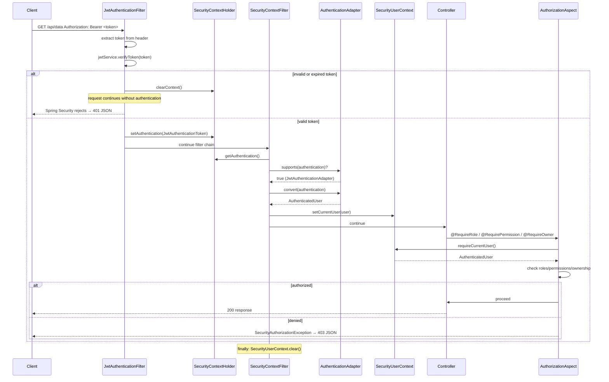
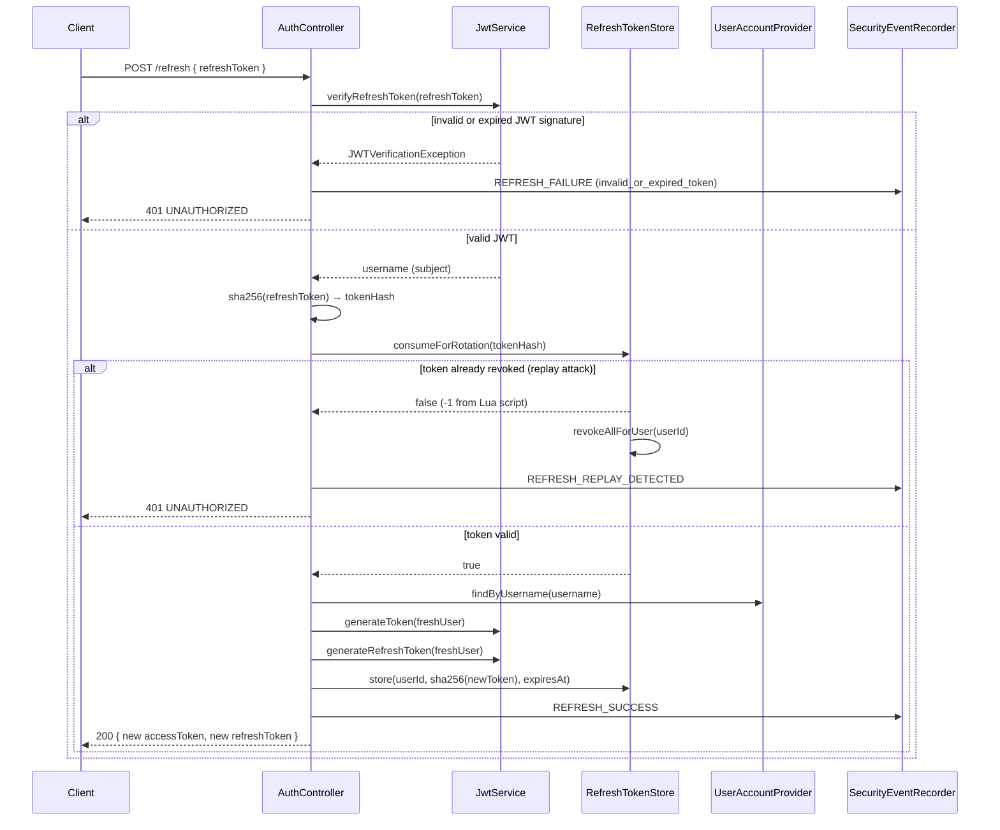
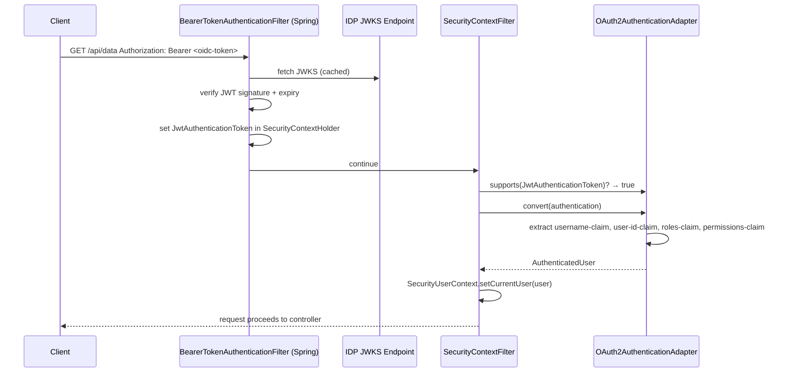

# Authentication Flow

This document traces every authentication path from the raw HTTP request to the populated `AuthenticatedUser` — for all three authentication modes.

---

## INTERNAL Mode — `/login` Flow



---

## INTERNAL Mode — Protected Request Flow



---

## INTERNAL Mode — Token Refresh Flow



### Replay Attack Detection

The `consumeForRotation` method is the security heart of the refresh flow. In Redis mode, it executes an atomic Lua script that:

1. Checks if the token hash exists
2. Checks if it has expired
3. Checks if it has already been revoked (`revoked = "1"`)
4. If revoked: returns `-1` (replay detected — caller revokeAllForUser)
5. If valid: atomically sets `revoked = "1"` and returns `1`

This ensures that even under concurrent requests, a refresh token can only be consumed once.

---

## OAUTH2 Mode — Request Flow



Claim names are configurable:
```properties
security.oauth2.username-claim=preferred_username
security.oauth2.user-id-claim=sub
security.oauth2.roles-claim=roles
security.oauth2.permissions-claim=permissions
```

---

## KEYCLOAK Mode — Role Extraction

KEYCLOAK mode extends OAUTH2 mode. The only difference is `KeycloakAuthenticationAdapter`, which extracts Keycloak's nested role structure:

```json
{
  "realm_access": {
    "roles": ["ADMIN", "USER"]
  },
  "resource_access": {
    "my-client": {
      "roles": ["client-role-a"]
    }
  }
}
```

| JWT claim path | Maps to |
|---|---|
| `realm_access.roles` | `AuthenticatedUser.getRoles()` |
| `resource_access.<clientId>.roles` | `AuthenticatedUser.getPermissions()` |

---

## Token Structure (INTERNAL Mode)

### Access Token Claims

| Claim | Value | Description |
|---|---|---|
| `sub` | username | JWT subject |
| `userId` | user's unique ID | Application user ID |
| `roles` | `["ADMIN", "USER"]` | Roles array |
| `permissions` | `["post:delete"]` | Permissions array |
| `type` | `"access"` | Token type discriminator |
| `jti` | UUID | Unique token ID |
| `iss` | configured issuer | Token issuer |
| `iat` | issued-at timestamp | |
| `exp` | expiry timestamp | |

### Refresh Token Claims

Refresh tokens intentionally contain **minimal claims** — only `sub`, `type=refresh`, `jti`, `iss`, `iat`, `exp`. Roles and permissions are re-fetched from `UserAccountProvider` on every refresh. This ensures that permission changes take effect on the next token rotation without waiting for the access token to expire.

---

## Logout Flow

```
POST /logout { refreshToken }
    │
    ▼ sha256(refreshToken)
    │
    ▼ refreshTokenStore.revoke(tokenHash)
    │   marks revoked = "1" in store
    │
    ▼ SecurityEventRecorder: LOGOUT + SESSION_REVOKED
    │
    ▼ 200 { message: "Logged out successfully." }
```
